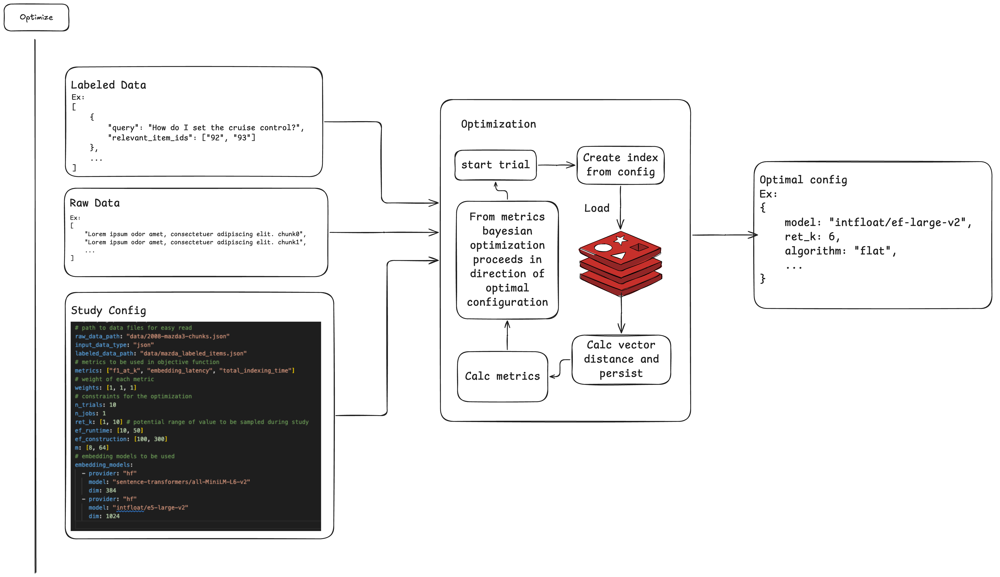
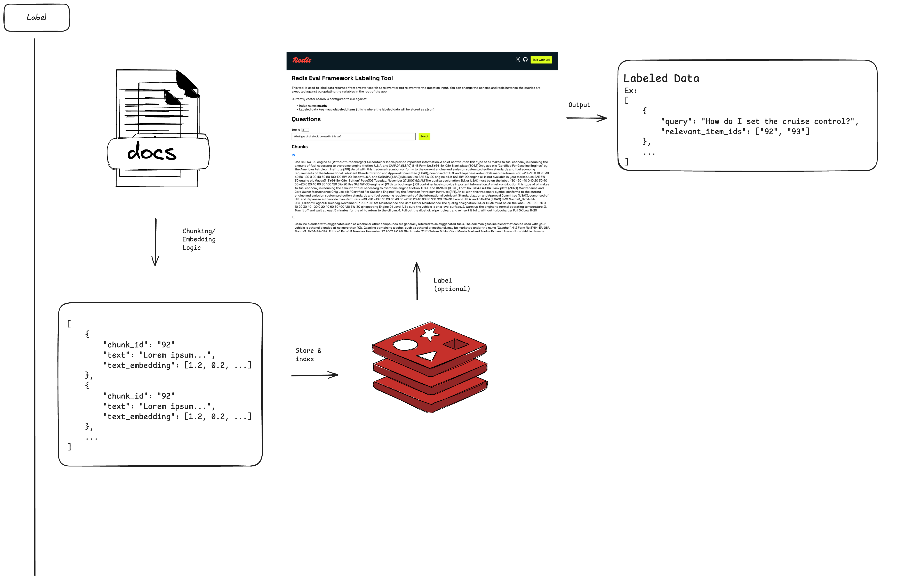
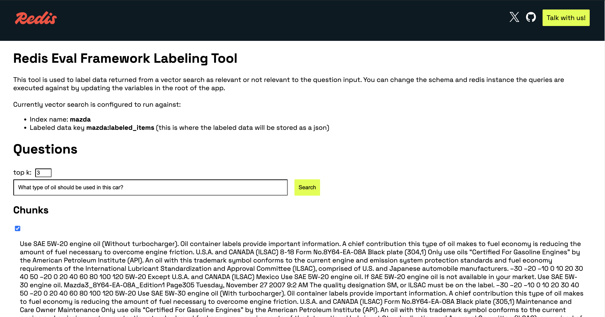
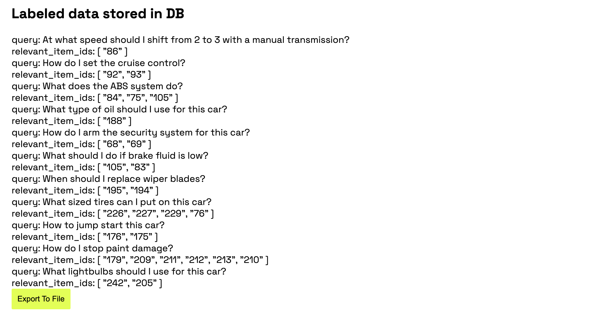

# Eval Framework

A tool for finding the optimal set of hyperparameters for retrieval from a vector index.

## General flow

The primary optimize flow takes 3 inputs: labeled data, raw data, and the study config. These input are used to run the relevant trials from which the best configuration is chosen.



If you do not already have a labeled set of data you can use the labeling tool to make it easier to select which chunks are relevant to a given question and output the results to a file that can be used in the optimization flow.



## Defining the study config

The study config looks like this (see ex_study_config.yaml in the root of the project):

```yaml
# path to data files for easy read
raw_data_path: "data/2008-mazda3-chunks.json"
input_data_type: "json"
labeled_data_path: "data/mazda_labeled_items.json"
# metrics to be used in objective function
metrics: ["f1_at_k", "embedding_latency", "total_indexing_time"]
# weight of each metric
weights: [1, 1, 1]
# constraints for the optimization
n_trials: 10
n_jobs: 1
ret_k: [1, 10] # potential range of value to be sampled during study
ef_runtime: [10, 50]
ef_construction: [100, 300]
m: [8, 64]
# embedding models to be used
embedding_models:
  - provider: "hf"
    model: "sentence-transformers/all-MiniLM-L6-v2"
    dim: 384
  - provider: "hf"
    model: "intfloat/e5-large-v2"
    dim: 1024
```

raw_data_path should link to a json file of the following form:
```json
[
  "chunk0",
  "chunk1",
  "..."
]
```

labeled_data_path should link to a json file of the following form:
```json
[
  {
    "query": "How long have sea turtles existed on Earth?",
    "relevant_item_ids": ["1", "54", "42"]
  }
]
```

## Running Optimization

If you already have a labeled data file running the optimization is as simple as:

```
python optimize.py --config ex_study_config.yaml
```

Note if you haven't already:
```
pip install -r requirements.txt
```

## Labeling data

The labeling tool is early stage but can be run locally to create a json if labeled data as shown above.

```
touch process_data/.env
```

in process_data/.env
```
REDIS_URL=
LABELED_DATA_PATH=
EMBEDDING_MODEL=sentence-transformers/all-MiniLM-L6-v2
SCHEMA_PATH=schema/index_schema.yaml
```

Run
```
pip install -r requirements.txt
cd process_data
fastapi dev main.py
```

Then with your file explorer open process_data.html

Input question and check the boxes for chunks that are relevant.

raw_data_path is of form `['chunk1.....', 'chunk2....']`. TODO: add configurable chunking right now assumed chunks are defined.

Once satisfied click "Save Labeled" to add as a record to persisted db record. Finally click "Export To File" to output the file which can be used as the input to the optimization.


