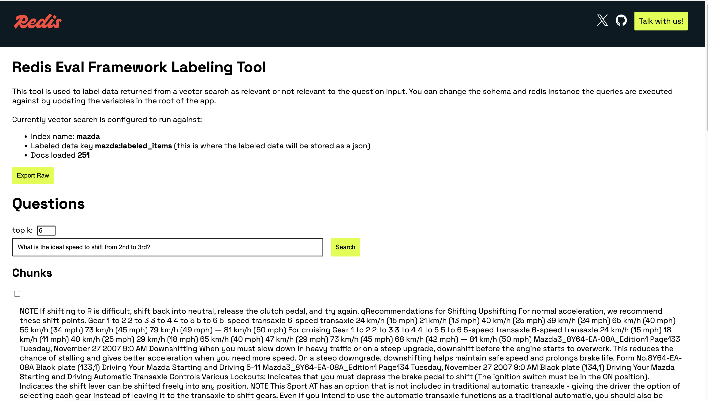

<div align="center">
<div> </div>
<h1>Retrieval Optimizer</h1>

[](https://opensource.org/licenses/MIT)


</div>

Search and information retrieval is a challenging problem. With the proliferation of vector search tools in the market, focus has heavily shifted towards SEO and marketing wins, rather than fundamental quality.

The **Retrieval Optimizer** from Redis focuses on measuring and improving retrieval quality. This framework helps determine optimal **embedding models**, **retrieval strategies**, and **index configurations** for your specific data and use case.

## Prerequisites
1. Make sure you have the following tools available:
   - [Docker](https://www.docker.com/products/docker-desktop/)
   - Python >= 3.11 and [Poetry](https://python-poetry.org/docs/#installation)

2. Clone the repository:
   ```bash
   git clone https://github.com/redis-applied-ai/retrieval-optimizer.git
   cd retrieval-optimizer
   ```

## Data requirements

The retrieval optimizer requires two sets of data to run an optimization study.

### Indexed data

The core knowledge base of data to be embedded in Redis. Think of these as your "chunks".

Expected Format:

```json
[
  {
    "text": "example content",
    "item_id": "abc:123"
  }
]
```

### Ground truth data
Labeled ground truth data for generating the metrics that we will compared between samples.

Expected Format:

```json
[
  {
    "query": "How long have sea turtles existed on Earth?",
    "relevant_item_ids": ["abc:1", "def:54", "hij:42"]
  }
]
```

Under the hood, the `item_id` is used to test if a vector query found the desired results (chunks) therefore this identifier needs to be unique to the text provided as input.


> [!IMPORTANT]  
> The next section covers how to create this set of input data but if you already have them available you can skip.

### Example data prep guide

Follow along with [examples/getting_started/populate_index.ipynb](examples/getting_started/populate_index.ipynb) to see an end-to-end example of data prep for retrieval optimization.

This guide will walk you through:

- chunking source data
- exporting that data to a format for use with the optimizer
- creating vector representations of the data
- loading them into a vector index

### Labeling ground truth data

Sometimes you have a pre-defined dataset of queries and expected matches. However, this is NOT always the case. We built a simple web GUI to help.

Assuming you have created data and populated an *initial* vector index with that data you can run the labeling app for a more convenient experience.

#### Running the data labeling app

1. First set up a fresh environment file:
  ```bash
  cp label_app/.env.template label_app/.env
  ```

2. Update the `.env` file (below is an example):
  ```
  REDIS_URL=<Redis connection url>
  LABELED_DATA_PATH=<file location for exported output>
  EMBEDDING_MODEL=sentence-transformers/all-MiniLM-L6-v2
  SCHEMA_PATH=schema/index_schema.yaml

  # Corresponding fields to return from index see label_app/main.py for implementation
  ID_FIELD_NAME=unique id of a chunk or any item stored in vector index
  CHUNK_FIELD_NAME=text content
  ```

3. Environment variable options:

  | Variable | Example Value | Description | Required |
  |----------|--------------|-------------|----------|
  | REDIS_URL | redis://localhost:6379 | Redis connection URL | Yes |
  | LABELED_DATA_PATH | label_app/data/labeled.json | File path where labeled data will be exported | Yes |
  | EMBEDDING_MODEL | sentence-transformers/all-MiniLM-L6-v2 | Name of the embedding model to use | Yes |
  | SCHEMA_PATH | schema/index_schema.yaml | Path to the index schema configuration | Yes |
  | ID_FIELD_NAME | item_id | Field name containing unique identifier in index | Yes |
  | CHUNK_FIELD_NAME | text | Field name containing text content in index | Yes |


4. **Run the data labeling app**

  ```bash
  docker compose up
  ```

This will serve the data labeling app at `localhost:8000/label`.
You can also interact with the swagger docs at `localhost:8000/docs`.

#### Using the data labeling app

The data labeling app will connect to the index specified in whatever file was provided as part of the `SCHEMA_PATH` environment variable. By default this is [label_app/schema/index_schema.yaml](label_app/schema/index_schema.yaml) if it connects properly you will see the name of the index and the number of documents it has indexed.



From here you can start making queries against your index, label the relevant chunks, and export to a JSON file for use in the optimization. This also a good way to test what's happening with your vector retrieval.


# Running an optimization study

With your data now prepared, you can run optimization studies. A study has a **config** with defined params and ranges to test and compare with your data.

## Run in notebook
Check out the following step by step notebooks for running the optimization process:

- Getting started: [examples/getting_started/retrieval_optimizer.ipynb](examples/getting_started/retrieval_optimizer.ipynb)
- Adding custom retrieval [examples/gettting_started/custom_retriever_optimizer.ipynb](examples/getting_started/custom_retriever_optimizer.ipynb)


## Run with poetry
### Define the config

The study config looks like this (see [ex_study_config.yaml](optimize/ex_study_config.yaml) as an example):

```yaml
# path to data files for easy read
raw_data_path: "label_app/data/2008-mazda3-chunks.json"
input_data_type: "json"
labeled_data_path: "label_app/data/mazda_labeled_items.json"
# metrics to be used in objective function
metrics: ["f1_at_k", "embedding_latency", "total_indexing_time"]
# weight of each metric
weights: [1, 1, 1]
# constraints for the optimization
n_trials: 10
n_jobs: 1
ret_k: [1, 10] # potential range of value to be sampled during study
ef_runtime: [10, 50]
ef_construction: [100, 300]
m: [8, 64]
# embedding models to be used
embedding_models:
  - provider: "hf"
    model: "sentence-transformers/all-MiniLM-L6-v2"
    dim: 384
  - provider: "hf"
    model: "intfloat/e5-large-v2"
    dim: 1024
```

### Study Config Options
TODO -- please document in a table like the env vars above


### Poetry Install & Setup

```bash
poetry install
```

```bash
poetry run study --config optimize/ex_study_config.yaml
```

### Example output

TODO

## Technical Motivation & Background

This framework implements a fairly common pattern for optimizing hyper-parameters called Bayesian Optimization using [Optuna](https://optuna.org/). **Bayesian Optimization** works by building a probabilistic model (typically Gaussian Processes) of the objective function and iteratively selecting the most promising configurations to evaluate. Unlike grid or random search, Bayesian Optimization balances exploration (trying new regions of the parameter space) and exploitation (focusing on promising areas), efficiently finding optimal hyper-parameters with fewer evaluations. This is particularly useful for expensive-to-evaluate functions, such as training machine learning models. By guiding the search using prior knowledge and updating beliefs based on observed performance, Bayesian Optimization can significantly improve both accuracy and efficiency in hyperparameter tuning.

In our case, we want to **maximize** the precision and recall of our vector search system while balancing performance tradeoffs such as embedding and indexing latency. Bayesian optimization gives us an automated way of testing all the knobs at our disposal to see which ones best optimize retrieval.

### Process diagram


